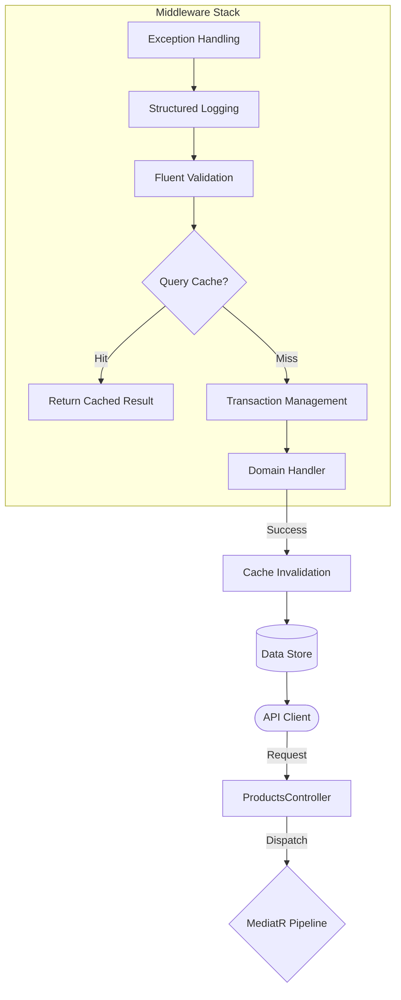

# 🏛️ Playbook.Infrastructure.CQRS

<div align="left">
    
    
    
</div>

---

## 📖 1. Executive Summary
> [!NOTE]  
> **The Problem:** In complex distributed systems, cross-cutting concerns like caching, validation, and logging often clutter business logic. Hard-coding these into handlers leads to "Fat Handlers," inconsistent error responses, and race conditions (Thundering Herd) during cache misses.
> 
> **The Solution:** A **High-Performance MediatR Middleware Pipeline**. This architecture leverages **Open Generics** and **Pipeline Behaviors** to decouple infrastructure from domain logic. It features a thread-safe **Query Caching Engine** with double-check locking, **Monadic Error Handling** via `ErrorOr`, and a centralized **Validation Gatekeeper**. The result is a clean, testable, and highly observable .NET 8 system that adheres to the "Single Responsibility Principle."

---
    
## 🏗️ 2. Design & Strategy

### 📊 System Visualization



### 🛠️ Technical Decisions   

| Choice | Technology | Rationale  |
|------------|------------|---------|
| Pattern | Pipeline Behaviors | Ensures cross-cutting concerns (Logging, Validation) are applied consistently without polluting Handlers. |
| Error Handling | Monadic `ErrorOr<T>` | Replaces throwing exceptions for flow control with functional, strongly-typed results, improving performance and readability. |
| Concurrency | `SemaphoreSlim` | Implemented per-key locking in `QueryCachingBehavior` to prevent "Cache Stampedes" in high-traffic environments. |
| Serialization | `System.Text.Json` | Optimized UTF-8 byte serialization for `IDistributedCache` to minimize memory allocations and CPU overhead. |
| Mapping | Reflection Factory | Uses compiled delegates in `ExceptionHandlingBehavior` to dynamically create `TResponse` error types without performance hits. |

## 💻 3. Implementation Blueprint

### 📂 Key Artifacts
* `QueryCachingBehavior.cs`: The performance anchor. Orchestrates the "Cache-Aside" pattern with a granular locking strategy using a `ConcurrentDictionary` of semaphores.
* `ValidationBehavior.cs`: The gatekeeper. Asynchronously executes all `FluentValidation` rules and short-circuits the pipeline if invariants are violated.
* `ExceptionHandlingBehavior.cs`: The safety net. Converts unhandled exceptions into standardized RFC 7807 Problem Details via ErrorOr's implicit conversion operator.
* `CacheInvalidationBehavior.cs`: The consistency worker. Purges related cache keys (e.g., `product-123`) only after successful state-changing commands.
* `ErrorOrExtensions.cs`: Functional utility suite. Provides `MapAsync` and `EnsureFound` to allow handlers to be written as elegant, readable pipelines.

> [!TIP]
> **Architect's Insight:** By ordering `ValidationBehavior` before `QueryCachingBehavior`, we ensure that the system never wastes I/O cycles checking a cache for a request that contains malformed or invalid data.

## 🚦 4. Verification Guide

### 🧪 Execution Steps

1. **Initialize:** `dotnet build`
2. **Execute (Write):** Call `POST /api/products`.
    * **Observe**: The `ValidationBehavior` checks the SKU/Price. If successful, `CacheInvalidationBehavior` ensures subsequent reads get fresh data.
3. **Execute (Read):** Call `GET /api/products/{id}`.
    * **Observe**: First call logs "Cache Miss." The second call logs "Cache Hit" and returns in < `1ms` without hitting the repository.
4. **Observe Logs:**
    * ```log
        INFO: Processing request CreateProductCommand
        INFO: Successfully invalidated: product-abc-123
        INFO: Request CreateProductCommand succeeded in 12.450ms
        ```

## ⚖️ 5. Trade-offs & Analysis

*Every architectural choice is a compromise.*

* ✅ **Strengths:** 
    * **Total Decoupling**: Handlers focus 100% on business logic; infrastructure is entirely "invisible".
    * **Observability**: Integrated high-resolution timing and error-code logging in every request.
    * **Scalability**: Distributed caching and parallel validation execution maximize throughput.
* ❌ **Weaknesses:**
    * **Pipeline Complexity**: Debugging the "stack trace" of behaviors can be daunting for junior developers.
    * **Memory Overhead**: The `_lockGroups` dictionary in the caching behavior requires periodic pruning in systems with millions of unique keys.
* 🔄 **Alternatives:** 
    * **Decorator Pattern**: Offers similar benefits but requires manual registration per handler, whereas Open Behaviors are "automatic".
    * **Action Filters**: Useful for Web APIs, but MediatR behaviors work across any entry point (CLI, Background Jobs, gRPC).
