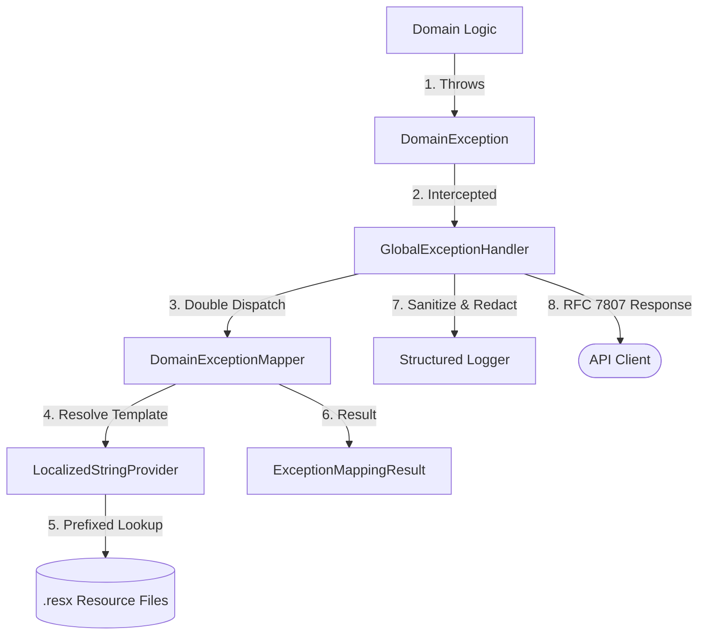

# 🏛️ Playbook.Infrastructure.Exceptions

    
    
    

---

## 📖 1. Executive Summary
> [!NOTE]  
> **The Problem:** In complex distributed systems, error handling often becomes a scattered mess of `try-catch` blocks, inconsistent API responses, and unlocalized messages. Hard-coding HTTP status codes within domain logic leaks infrastructure concerns into the core, while naive logging often accidentally exposes PII (Personally Identifiable Information).
> 
> **The Solution:** A centralized **Domain-Driven Error Handling & Localization Framework**. Built on the **Visitor Pattern**, this architecture uses **Double-Dispatch** to map domain exceptions to RFC 7807 Problem Details polymorphically. It features a high-performance **Span-based Localization Provider** with Concurrent Caching, **PII-Aware Structured Logging**, and a **Global .NET 8 Exception Handler** that ensures zero-leakage of internal implementation details in production.

---
    
## 🏗️ 2. Design & Strategy

### 📊 System Visualization

### 🛠️ Technical Decisions   

| Choice | Technology | Rationale  |
|------------|------------|---------|
| Pattern | Visitor (Double Dispatch) | Decouples Domain Exceptions from HTTP concerns. Exceptions "choose" their mapping logic without `switch` expressions on types. |
| Response | RFC 7807 | Adheres to the industry standard "Problem Details for HTTP APIs" using .NET 8 `ValidationProblemDetails`. |
| Localization | IStringLocalizer | Uses native .NET localization but adds a custom Provider to handle dynamic resource routing via key prefixes (VAL_, RULE_, etc.). |
| Performance | Span<T> & FrozenSet | Uses `ReadOnlySpan<char>`for allocation-free prefix checking and `FrozenSet` for O(1) PII redaction checks. |
| Middleware | IExceptionHandler | Replaces older middleware patterns with the modern .NET 8 interface for better performance and pipeline integration. |

## 💻 3. Implementation Blueprint

### 📂 Key Artifacts
* `GlobalExceptionHandler.cs`: The core middleware orchestrator. Manages the lifecycle of an error, from discovery to logging and serialized response.
* `DomainExceptionMapper.cs`: Implements the `IExceptionMapper` (Visitor). Contains the specific translation logic for `NotFound`, `Validation`, and `BusinessRule` exceptions.
* `LocalizedStringProvider.cs`: The "Brain" of localization. Uses `ConcurrentDictionary` for caching localizers and `Span` to strip prefixes before resource lookup.
* `GlobalProblemDetailsFactory.cs`: Overrides the default ASP.NET Core factory to ensure framework-level errors (like model binding failures) are localized and formatted identically to domain errors.
* `SecurityConstants.cs`: Houses an immutable `FrozenSet` of sensitive keys, ensuring that PII like `CreditCard` or `Password` is never leaked into application logs.

> [!TIP]
> **Architect's Insight:** Avoid putting HTTP status codes inside your Exception classes. Your Domain layer should not know about `404 Not Found` or `422 Unprocessable Entity`. Use a `DomainExceptionMapper` to keep your business logic pure and your infrastructure flexible.

## 🚦 4. Verification Guide

### 🧪 Execution Steps

1. **Initialize:** `dotnet build`
2. **Execute:** Run any API endpoint that triggers a `ValidationException` or `BusinessRuleException`.
3. **Observe:**
    * **Response**: You will receive a standardized JSON payload with a `traceId`, `errorCode`, and localized `detail`.
    * **Logs**: Check the console/log files. You will see structured logs. If a validation error occurred on a "Password" field, the log will show `[Password: ***]`, proving PII redaction is active.
    * **Culture**: Send the header `Accept-Language: tr-TR`. The `title` and `detail` fields will switch to Turkish automatically via the `RequestLocalization` middleware.

## ⚖️ 5. Trade-offs & Analysis

*Every architectural choice is a compromise.*

* ✅ **Strengths:** 
    * **Strict Separation of Concerns**: Domain logic remains agnostic of the delivery mechanism (REST, gRPC, etc.).
    * **PII Safety**: Built-in redaction prevents accidental compliance violations in logs.
    * **Developer Ergonomics**: New exceptions are added by implementing one method in the mapper, keeping the logic centralized.
* ❌ **Weaknesses:**
    * **Marker Class Proliferation**: Requires a marker class per `.resx` file to support the `LocalizedStringProvider` logic.
    * **Consistency Dependency**: Relies on developers following the `PREFIX_KEY` naming convention for localization to work correctly.
* 🔄 **Alternatives:** 
    * **FluentResults**: Good for local flow control, but lacks the global, "set-it-and-forget-it" infrastructure coverage provided by this middleware approach.
    * **Hellang.Middleware**: A popular community package, though this implementation leverages native .NET 8 features to reduce external dependencies.
