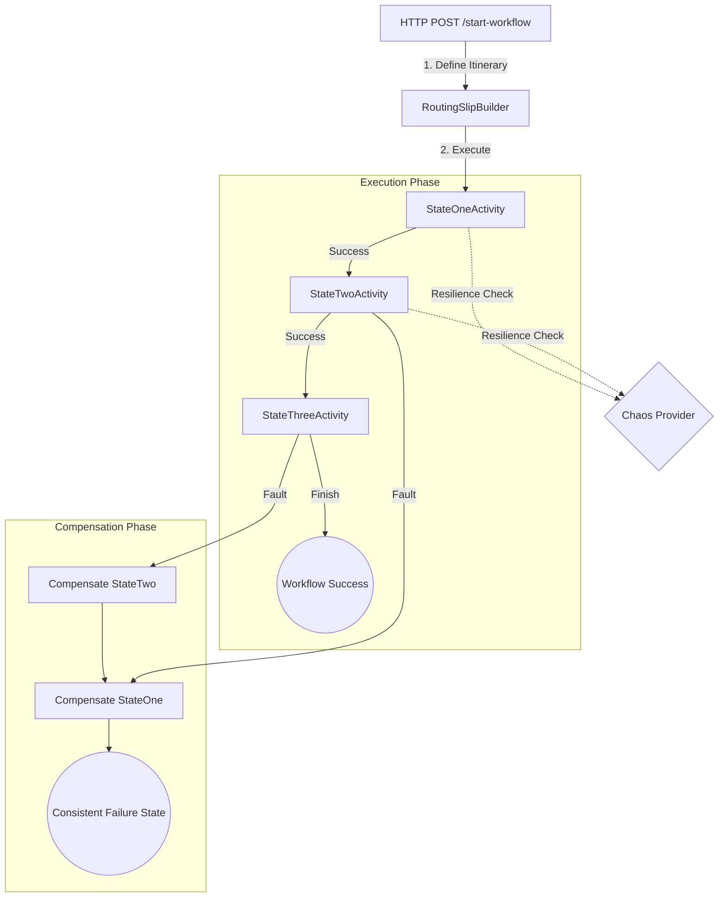

# 🏛️ Playbook.Messaging.MassTransit.Courier

    
    
    

---

## 📖 1. Executive Summary
> [!NOTE]  
> **The Problem:** In complex distributed systems, executing a sequence of operations across multiple services often requires "all-or-nothing" atomicity. Traditional 2PC (Two-Phase Commit) is non-performant and fragile in microservices. The challenge is ensuring that if Step 3 of a 5-step process fails, Steps 1 and 2 are gracefully reverted to maintain data integrity.
> 
> **The Solution:** This implementation leverages the **Routing Slip** pattern via **MassTransit Courier**. By defining an "Itinerary" of activities, the system treats the workflow as a "Traveler." Each activity contains both forward execution logic and backward compensation logic. If any activity faults, Courier automatically navigates the slip in reverse, executing compensation logic for every previously completed step.

---
    
## 🏗️ 2. Design & Strategy

### 📊 System Visualization

### 🛠️ Technical Decisions   

| Choice | Technology | Rationale  |
|------------|------------|---------|
| Runtime | .NET 10 | Leverages the latest performance optimizations and C# 14 features for high-throughput messaging. |
| Orchestration | MassTransit Courier | Provides a robust, battle-tested implementation of the Routing Slip pattern with built-in retry and compensation handling. |
| Transport | In-Memory | Used here for demonstration and rapid integration testing; easily swappable for RabbitMQ or Azure Service Bus. |
| Resilience | `IChaosProvider` | Decoupled failure injection strategy to validate that compensation logic actually works under stress. |

## 💻 3. Implementation Blueprint

### 📂 Key Artifacts
* `Program.cs`: The central orchestrator. It builds the `RoutingSlip` and maps the API surface to the messaging bus.
* Activities (IActivity): Discrete units of work (`StateOne`, `StateTwo`). Each defines its own `Arguments` for input and `Log` for state-tracking during compensation.
* `IExecuteActivity`: Used for `StateThree`. Since it's a terminal step with no further downstream risks in this workflow, it implements an execution-only contract to reduce overhead.
* `RoutingSlipMetricsConsumer`: An asynchronous observer that decouples business logic from telemetry; it listens for terminal events (`Completed/Faulted`) to log performance.

> [!TIP]
> **Architect's Insight:** Always ensure your compensation logic is **Idempotent**. In a distributed environment, a compensation step might be retried multiple times. If your `Compensate` method isn't safe to run twice, you risk leaving the system in a "Zombie" state.

## 🚦 4. Verification Guide

### 🧪 Execution Steps

1. **Initialize:** `dotnet build`
2. **Execute:** `dotnet run`
3. **Trigger Workflow:** `curl -X POST http://localhost:5000/start-workflow`
4. **Observe Logs:**
    * Look for `[FORWARD]` tags to see the progress of the Routing Slip.
    * Since the `ChaosProvider` has a **50% failure rate**, you will eventually see `[BACKWARD]` tags. This confirms the system is automatically rolling back state upon failure.
    * Watch for the `RoutingSlipMetricsConsumer` outputting `🏆 WORKFLOW SUCCESS` or `❌ WORKFLOW FAILED`.

## ⚖️ 5. Trade-offs & Analysis

*Every architectural choice is a compromise.*

* ✅ **Strengths:** 
    * **Loose Coupling**: Activities don't need to know about each other; only the orchestrator knows the sequence.
    * **Automated Resilience**: MassTransit handles the complex "reverse-order" logic of rollbacks.
    * **Dynamic Itineraries**: You can conditionally add steps to the slip at runtime.
* ❌ **Weaknesses:**
    * **Eventual Consistency**: The system is not "locked" during execution; other processes may see intermediate states.
    * **Observability Overhead**: Requires robust logging (like the included MetricsConsumer) to track where a "Traveler" is in a long-running slip.
* 🔄 **Alternatives:** 
    * Use **State Machines (Sagas)** if the workflow requires waiting for external events (e.g., waiting for a human approval) rather than a continuous sequence of automated steps.
