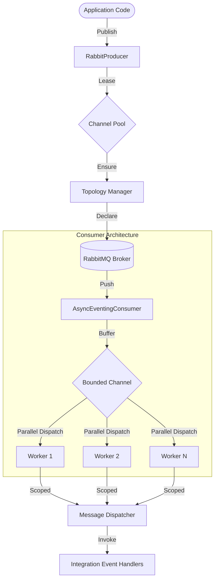

# 🏛️ Playbook.Messaging.RabbitMQ

    
    
    
    

---

## 📖 1. Executive Summary
> [!NOTE]  
> **The Problem:** Standard RabbitMQ implementations often suffer from "Channel Churn" (high overhead from opening/closing channels), lack of built-in backpressure, and complex boilerplate for topology management. In high-throughput .NET applications, manual thread management and reflection-based serialization create significant performance bottlenecks.
> 
> **The Solution:** A **High-Performance RabbitMQ Messaging Engine** built for .NET 10. This architecture features an asynchronous **Channel Pool** with `SemaphoreSlim` throttling, **STJ Source Generation** for zero-reflection serialization, and a **Decoupled Consumer Engine** utilizing `System.Threading.Channels` for internal load balancing. It automates idempotent **Topology Discovery**, ensuring infrastructure is declared just-in-time without manual intervention.

---
    
## 🏗️ 2. Design & Strategy

### 📊 System Visualization

### 🛠️ Technical Decisions   

| Choice | Technology | Rationale  |
|------------|------------|---------|
| Pooling | `ConcurrentQueue` + `SemaphoreSlim` | Implements a "warm" channel pool to eliminate the 3-way handshake latency of opening new AMQP channels per message. |
| Backpressure | `Bounded Channel<T>` | Prevents memory exhaustion by limiting the number of in-flight messages within the application before a Nack/Requeue is triggered. |
| Concurrency | Parallel Worker Pool | Decouples the RabbitMQ I/O thread from message processing, allowing $N$ workers to handle CPU-bound logic simultaneously. |
| Serialization | `System.Text.Json` Source Gen | Uses `MessagingJsonContext` to remove runtime reflection, significantly reducing GC pressure and increasing throughput. |
| Reliability | Connection Resilience | Leverages RabbitMQ.Client v7+ automatic recovery with custom `NetworkRecoveryInterval` and `Persistent` delivery modes. |

## 💻 3. Implementation Blueprint

### 📂 Key Artifacts
* `PersistentConnection.cs`: The core infrastructure anchor. Manages a resilient connection and a thread-safe pool of `IChannel` instances via `ChannelLease`.
* `RabbitConsumerEngine<T>.cs`: The background orchestrator. Uses a worker-pool pattern to process messages from a bounded internal buffer.
* `RabbitTopologyManager.cs`: The automated architect. Idempotently ensures exchanges and dead-letter queues exist using a double-check locking gate.
* `MessageDispatcher.cs`: The execution bridge. Creates an `AsyncServiceScope` per message to ensure database contexts and other scoped dependencies are safely isolated.
* `MessagingBuilder.cs`: The fluent configuration API. Allows developers to register producers and consumers with a clean, descriptive DSL.

> [!TIP]
> **Architect's Insight:** By using `ValueTask` across the entire pipeline, we minimize heap allocations for operations that frequently complete synchronously (like retrieving a channel from the pool), which is critical for high-frequency messaging.

## 🚦 4. Verification Guide

### 🧪 Execution Steps

1. **Initialize:** `dotnet build` (Generates STJ Source Code).
2. **Configuration:** Ensure `appsettings.json` contains the `RabbitMq` section.
3. **Run:** `dotnet run`.
4. **Publishing (Write):** Call `POST /orders`.
    * **Observe:** The `RabbitProducer` acquires a lease, ensures the `orders.v1.exchange exists`, and serializes the payload.
5. **Consumption (Read):** 
    * **Observe:** The `RabbitConsumerEngine` picks up the message.
    * **Observe:** Multiple handlers (`InventoryUpdateHandler`, `NotificationHandler`) execute in parallel within their own DI scopes.
6. **Error Handling:** Force a handler exception.
    * **Observe:** The message is `Nack'd` with `requeue: false` and automatically routed to the Dead Letter Exchange (DLX).

## ⚖️ 5. Trade-offs & Analysis

*Every architectural choice is a compromise.*

* ✅ **Strengths:** 
    * **Resource Efficiency**: Channel pooling prevents broker-side resource exhaustion.
    * **Strict Concurrency Control**: `MaxConcurrency` and `PrefetchCount` allow fine-grained tuning of system load.
    * **Developer Experience**: "Just-in-time" topology means developers don't need to manually create exchanges/queues in the RabbitMQ UI.
* ❌ **Weaknesses:**
    * **Sequential Batching**: `PublishBatchAsync` currently publishes messages sequentially over a single channel; for extreme throughput, multiple channels could be used.
    * **Memory Buffering**: In-memory bounded channels mean unacknowledged messages in the buffer are lost if the process crashes (though they remain in RabbitMQ).
* 🔄 **Alternatives:** 
    * **MassTransit**: A much heavier abstraction. This implementation is preferred when you need high-performance, low-level control with minimal dependencies.
    * **Raw RabbitMQ Client**: Requires significant boilerplate for connection recovery and thread safety which this library encapsulates.
