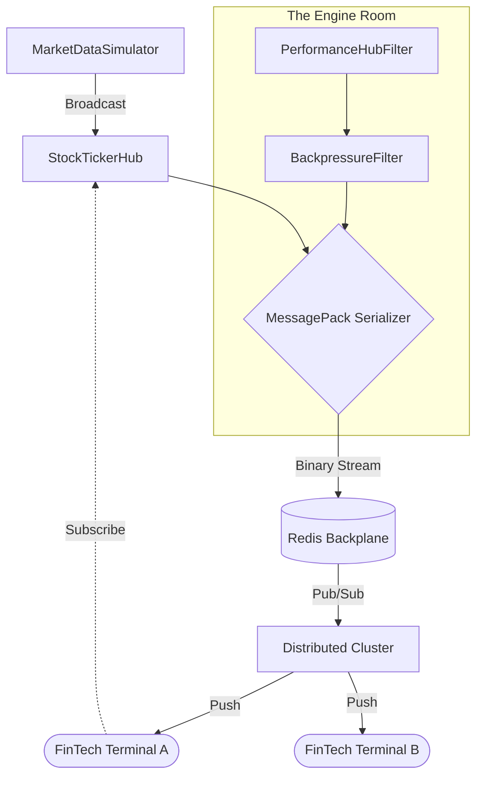

# 🏛️ Playbook.Messaging.SignalR

<div align="left">
    
    
    
</div>

---

## 📖 1. Executive Summary
> [!NOTE]  
> **The Problem:** Delivering high-frequency financial data (100ms ticks) to thousands of concurrent users creates immense pressure on GC, network bandwidth, and server-side CPU. Standard JSON-based WebSockets often suffer from high latency, "magic string" fragility, and "Head-of-Line" blocking.
> 
> **The Solution:** A **High-Performance SignalR Market Engine**. This architecture leverages **MessagePack binary serialization**, **Source-Generated Logging**, and **Stateful Reconnects** to provide a resilient, low-latency streaming pipeline. It features a background **Market Data Simulator** for load testing, **Hub Filters** for performance profiling, and a **Redis Backplane** for horizontal scalability across distributed nodes.

---
    
## 🏗️ 2. Design & Strategy

### 📊 System Visualization



### 🛠️ Technical Decisions   

| Choice | Technology | Rationale  |
|------------|------------|---------|
| Protocol | MessagePack (LZ4) | Drastically reduces payload size and serialization overhead compared to JSON, critical for 10Hz updates. |
| Transport | SignalR Groups | Efficiently segments traffic by ticker symbol, ensuring clients only receive data for their active portfolio. |
| Resilience | Stateful Reconnect | Utilizes .NET 8+ features to buffer missed messages (128KB) during transient network drops, maintaining stream integrity. |
| Diagnostics | Source-Generated Logging | Minimizes allocation and CPU cycles in high-traffic paths by using pre-compiled logging delegates. |
| Concurrency | PeriodicTimer | Replaces older threading timers to provide a "safe" async execution loop that avoids re-entrancy during simulations. |

## 💻 3. Implementation Blueprint

### 📂 Key Artifacts
* `StockTickerHub.cs`: The central gateway. Uses strongly-typed interfaces (`IStockClient`) to eliminate runtime messaging errors and manage group subscriptions.
* `MarketDataSimulator.cs`: The heartbeat. A non-blocking `BackgroundService` that broadcasts updates using a pre-sized task array to maximize throughput.
* `PerformanceHubFilter.cs`: The profiler. A global filter using `Stopwatch.GetTimestamp` to flag any hub method exceeding a 5ms execution threshold.
* `RealTimeExtensions.cs`: The orchestrator. Encapsulates complex DI logic, HFT-style tunings, and security constraints (32KB payload limits).
* `StockPrice.cs`: The DTO. A `readonly record struct` optimized for zero-allocation passing and MessagePack-ready binary mapping.

> [!TIP]
> **Architect's Insight:** By using `ValueTask` for Hub subscription methods and `readonly record structs` for data packets, we significantly reduce LOH (Large Object Heap) fragmentation, which is the primary cause of "stuttering" in high-frequency trading dashboards.

## 🚦 4. Verification Guide

### 🧪 Execution Steps

1. **Infrastructure:** Ensure Redis is running (`docker run -p 6379:6379 redis`).
2. **Launch:** `dotnet run`. The `MarketDataSimulator` begins ticking immediately.
3. **Simulated Load:** The `ManualTestClient` (Background Service) spawns "ALICE" and "BOB" traders.
4. **Observe Output:**
    * ```log
        [ALICE   ] TICK | BTC   | $64,231.50
        [BOB     ] TICK | MSFT  | $420.12
        [ALICE   ] TICK | ETH   | $3,450.88
        WARN: Slow Hub Method Execution: SubscribeToStock took 12ms
        ```

## ⚖️ 5. Trade-offs & Analysis

*Every architectural choice is a compromise.*

* ✅ **Strengths:** 
    * **Sub-Millisecond Latency**: Optimized serialization and non-allocating code paths ensure rapid data delivery.
    * **Strong Typing**: Compile-time safety for client-side events prevents production "undefined" errors.
    * **Elastic Scaling**: Redis integration allows the system to scale to hundreds of thousands of connections.
* ❌ **Weaknesses:**
    * **Binary Debugging**: MessagePack payloads are not human-readable in Fiddler/DevTools without specific extensions.
    * **Memory Buffering**: Stateful reconnection buffers consume server RAM; high connection counts require careful memory capacity planning.
* 🔄 **Alternatives:** 
    * **gRPC Streaming**: Excellent for server-to-server, but SignalR provides better browser compatibility and automatic transport fallback (WebSockets -> Long Polling).
    * **Raw WebSockets**: Lower overhead but lacks the built-in Group management, Reconnection logic, and Hub abstractions provided here.
