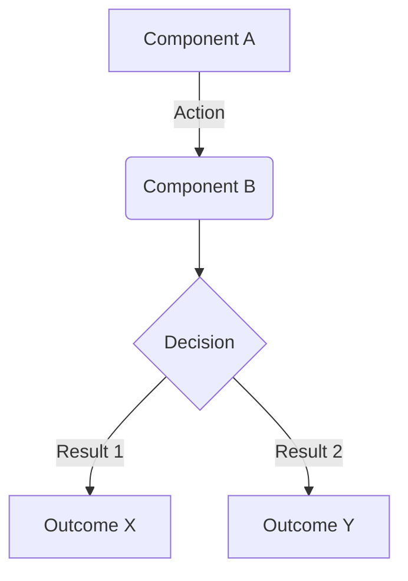

# 🏛️ [Chapter Name: e.g., Persistence with Redis]

<div align="left">
    
    
    
</div>

---

## 📖 1. Executive Summary
> [!NOTE]  
> **The Problem:** [Describe the specific architectural challenge here.]
> 
> **The Solution:** [Explain how this specific implementation resolves that challenge.]

---

## 🏗️ 2. Design & Strategy

### 📊 System Visualization


### 🛠️ Technical DecisionsChoiceTechnologyRationale

| Choice | Technology | Rationale  |
|------------|------------|---------|
| Language | .NET 8 | [e.g., Performance, C# 12 features] |
| Library | [Name] | [e.g., Industry standard, ease of use] |
| Storage | [Name] | [e.g., Distributed vs Local] |

## 💻 3. Implementation Blueprint

### 📂 Key Artifacts
* **[File.cs]:** [Explain why this file is the most important one to read.]
* **[Folder/]:** [Explain the responsibility of this specific sub-folder.]

[!TIP]
Architect's Insight: [Insert a professional "Best Practice" or "Gotcha" here that developers often miss.]

## 🚦 4. Verification Guide

### 🐳 Infrastructure (Docker)

```bash
# How to spin up the required environment
docker-compose up -d [Service]
```

### 🧪 Execution Steps

1. **Initialize:** dotnet build
2. **Execute:** dotnet run --project [ProjectPath]
3. **Observe:** [What specific logs or UI changes prove success?]

## ⚖️ 5. Trade-offs & Analysis

*Every architectural choice is a compromise.*

* ✅ **Strengths:** [e.g., High throughput, Low coupling]
* ❌ **Weaknesses:** [e.g., Eventual consistency, Complexity]
* 🔄 **Alternatives:** [When should a developer consider a different approach?]
