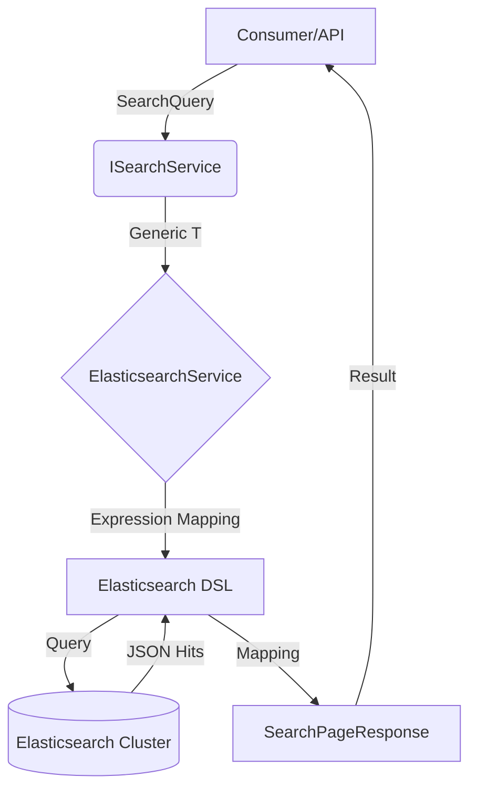

# 🏛️ Search Infrastructure with Elasticsearch

<div align="left">
    
    
    
</div>

---

## 📖 1. Executive Summary

> [!NOTE]  
> **The Problem:** Implementing a robust search layer often leads to leaked infrastructure concerns (Leaky Abstractions), where Elasticsearch-specific DSL or complex pagination logic pollutes the Application layer, making the system difficult to maintain or unit test.
> 
> **The Solution:** This implementation provides a generic, type-safe abstraction built on .NET 8. By utilizing a "Result Pattern" for communication and Expression-to-DSL mapping, it encapsulates complex Elasticsearch operations (like keyword-sorting and multi-match queries) behind a clean, domain-centric interface.

---

## 🏗️ 2. Design & Strategy

### 📊 System Visualization



### 🛠️ Technical Decisions

| Choice | Technology | Rationale  |
|------------|------------|---------|
| Language | .NET 8 | Leverages Primary Constructors and C# 12 features for concise, readable boilerplate. |
| Library | Elastic.Clients.Elasticsearch | The official modern client providing a fluent API and improved performance over the legacy NEST. |
| Result Pattern | `SearchOperationResult` | Avoids expensive exception-based flow control for expected search failures (e.g., node timeouts). |
| Pagination | `SearchPageResponse` | Encapsulates metadata (TotalCount, ExecutionTime) to ensure UI clients have all context for rendering. |

## 💻 3. Implementation Blueprint

### 📂 Key Artifacts
* **ISearchService.cs:** The core contract that hides the search engine implementation details from the domain.
* **ElasticsearchService.cs:** The sealed implementation handling index naming conventions and the bridge between .NET and Elastic.
* **ElasticSearchExtensions.cs:** The "Logic Engine" that parses C# Expressions to handle the critical distinction between analyzed `text` fields and non-analyzed `keyword` fields.
* **SearchQuery.cs:** A DTO that transforms consumer intent (Page, Filters, Term) into a structure the infrastructure can execute.

> [!TIP]
> **Architect's Insight:** Always use the `.keyword` sub-field for sorting and aggregations on string fields. In Elasticsearch, "text" fields are tokenized for search, making them impossible to sort alphabetically. This implementation automates this via `ApplySort` to prevent common runtime errors.

## 🚦 4. Verification Guide

### 🐳 Infrastructure (Docker)

```bash
# How to spin up the required environment
docker-compose up
```

### 🧪 Execution Steps

1. **Initialize:** Ensure `appsettings.json` has the correct `Elasticsearch:Url`.
2. **Execute:** `dotnet run --project Playbook.Persistence.ElasticSearch`
3. **Observe:** Check logs for `Elasticsearch: Query failed` or `Bulk indexing had X errors` for debugging insights.

## ⚖️ 5. Trade-offs & Analysis

*Every architectural choice is a compromise.*

* ✅ **Strengths:**
    * **Decoupled:** The UI/API doesn't need to know Elasticsearch exists; it only interacts with `SearchQuery`.
    * **Performance:** Uses `Stopwatch.GetElapsedTime` and `ValueTask` for low-allocation, high-throughput search paths.
    * **Resilience:** Implements the Options Pattern with `ValidateOnStart` to catch configuration errors before the first request hits.
* ❌ **Weaknesses:**
    * **Abstraction Overhead:** Extremely complex Elasticsearch features (like parent-child joins or nested aggregations) might require extending the generic service.
    * **Mapping Dependency:** Relies on the convention that string fields have a `.keyword` sub-field in the index.
* 🔄 **Alternatives:** 
    * For simple applications, a direct client call in the Controller is faster to write but impossible to test.
    * Consider **OpenSearch** if licensing requirements prevent the use of the official Elastic client.
