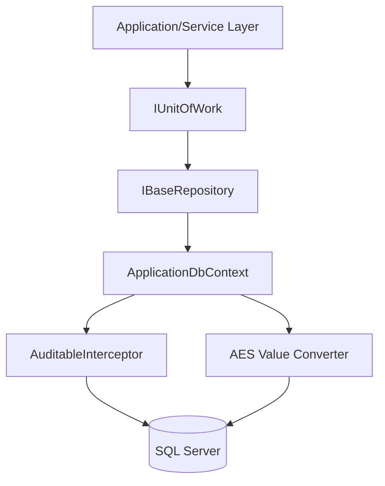

# 🏛️ Playbook.Persistence.EntityFramework

<div align="left">
    
    
    
</div>

---

## 📖 1. Executive Summary

[!NOTE]

**The Problem:** Many EF Core implementations suffer from "Leaky Abstractions," where database concerns bleed into the domain layer. Additionally, handling cross-cutting concerns like Soft Deletes, Auditing, and At-Rest Encryption often leads to repetitive, error-prone boilerplate across every entity and repository.

**The Solution:** This chapter demonstrates a production-hardened Persistence Layer using **EF Core 8**. It utilizes **Interceptors** for automated auditing, **Value Converters** with custom annotations for transparent AES encryption, and a robust **Repository/Unit of Work** pattern to encapsulate complex query logic and transaction management.

---

## 🏗️ 2. Design & Strategy

### 📊 System Visualization


### 🛠️ Technical Decisions

| Choice | Technology | Rationale  |
|------------|------------|---------|
| ORM | EF Core 8 | Industry standard with high-performance features like `AsNoTracking` and Interceptors. |
| Encryption | AES-256 | Implemented via `ValueConverter` to ensure PII (Email) is encrypted at rest without manual calls. |
| Patterns | Repository & UoW | Decouples the domain from the persistence framework and manages atomic transactions. |
| Filtering | Global Query Filters | Implements Soft Deletes (`IsActive`) globally, reducing the risk of data leaks. |

## 💻 3. Implementation Blueprint

### 📂 Key Artifacts
* `IUnitOfWork.cs`: The orchestrator of transactions. It ensures that multiple repository operations succeed or fail as a single atomic unit.
* `AuditableEntityInterceptor.cs`: A middleman that automatically injects `CreatedAt` and `CreatedBy` metadata whenever `SaveChanges` is called.
* `PropertyBuilderExtensions.cs`: Contains the `.Encrypt()` fluent API, allowing developers to flag sensitive properties for automatic AES encryption during the configuration phase.
* `PaginateExtensions.cs`: Provides memory-safe pagination logic, preventing "scraping" attacks by capping result sizes.

[!TIP]
**Architect's Insight:** Notice the `entry.Property(x => x.CreatedAt).IsModified = false;` in the Interceptor. This is a critical technical safeguard. It prevents malicious or accidental updates to creation metadata during "Update" operations, ensuring the integrity of your audit trail even if the tracked object is tampered with in memory.

## 🚦 4. Verification Guide

### 🐳 Infrastructure (Docker)

```bash
# How to spin up the required environment
docker-compose up
```

### 🧪 Execution Steps

1. **Initialize:** `dotnet build`
2. **Execute:** `dotnet run --project Playbook.Persistence.EntityFramework`
3. **Observe:** Check logs for `INSERT` statements to see the `CreatedAt` field being populated automatically.
    * Inspect the `Users` table; the `Email` column should contain Base64 encrypted strings, while the application reads them as plain text.

## ⚖️ 5. Trade-offs & Analysis

*Every architectural choice is a compromise.*

* ✅ **Strengths:** * **Developer Ergonomics:** Auditing and Encryption are "set and forget.
    * **Security:** Transparent encryption ensures sensitive data (PII) is never stored in plain text.
    * **Testability:** The Repository interfaces allow for easy mocking of the data layer.
* ❌ **Weaknesses:** * **Performance Overhead:** AES encryption/decryption adds a small CPU cost per row; global filters can occasionally impact complex query execution plans.
    * **Abstraction Complexity:** For very simple CRUD apps, the Repository/UoW pattern might be considered "over-engineering.
* 🔄 **Alternatives:** * **Dapper:** Use for high-performance Read-Models or complex reporting queries where EF Core's overhead is undesirable.
    * **Always Encrypted (SQL Server)**: A database-level alternative to application-side AES encryption, though it requires more infrastructure configuration.
