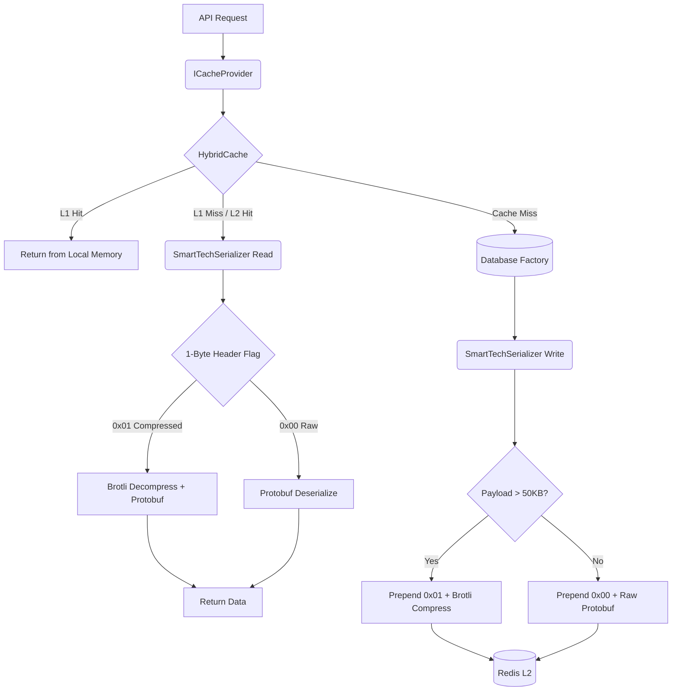

# 🏛️ Playbook.Persistence.HybridCaching

    
    
    

---

## 📖 1. Executive Summary
> [!NOTE]  
> **The Problem:** High-traffic APIs fetching large collections suffer from severe memory pressure, high CPU overhead during serialization, and excessive network latency when communicating with distributed L2 caches (like Redis). Standard text-based serialization (JSON) and naive single-layer caching strategies easily buckle under heavy concurrent load, leading to cache stampedes and out-of-memory (OOM) exceptions.
> 
> **The Solution:** A specialized, high-performance L1/L2 caching architecture built on .NET 8's `HybridCache`. It integrates deterministic binary serialization (Protobuf) with a dynamic, size-aware Brotli compression pipeline (`SmartTechSerializer<T>`). Payloads exceeding 50KB are compressed on-the-fly, drastically reducing Redis network I/O and storage footprint, while type-specific cache policies (`ICachePolicy<T>`) enforce granular TTLs and tag-based invalidation boundaries.

---
    
## 🏗️ 2. Design & Strategy

### 📊 System Visualization

### 🛠️ Technical Decisions   

| Choice | Technology | Rationale  |
|------------|------------|---------|
| Language | .NET 10 | Leverages primary constructors, collection expressions, and high-performance `Span<T>` / `IBufferWriter<byte>` APIs. |
| Orchestrator | `Microsoft.Extensions.Caching.Hybrid` | Provides built-in stampede protection, atomic Get-or-Create, and seamless L1 (Memory) to L2 (Distributed) fallback. |
| Serialization | `protobuf-net` | Delivers dense, deterministic binary payloads, vastly outperforming `System.Text.Json` in throughput and size. |
| Compression | `BrotliStream` | Industry-leading compression ratio for large payloads, tuned to `CompressionLevel.Fastest` to balance CPU overhead. |
| Storage | Redis | Highly available, distributed L2 cache supporting tag-based mass invalidation and horizontal scaling. |

## 💻 3. Implementation Blueprint

### 📂 Key Artifacts
* `SmartTechSerializer.cs`: The core engine of this implementation. It bypasses standard serializers to inject a custom 1-byte control header (0x00 or 0x01) and intercepts large payloads (>50KB) to stream them directly through a Brotli compression layer.
* `BufferWriterStream.cs`: A critical, zero-allocation adapter. It allows `BrotliStream` and Protobuf to write directly into the `IBufferWriter<byte>` managed by `HybridCache`, preventing intermediate Large Object Heap (LOH) allocations.
* `CacheKeyProvider.cs`: Enforces strict nomenclature for cache keys (`{SchemaVersion}:{Namespace}:{Prefix}:{Id}`).
* `ICachePolicy<T>` **(Implementations)**: Decouples caching rules from business logic, allowing unique L1/L2 expirations, tags, and memory-bypass flags per entity type.

> [!TIP]
> **Architect's Insight:** *The Schema Versioning Gotcha*
When deploying new application versions with modified models (e.g., added/removed properties), existing binary data in Redis can cause deserialization crashes ("Poison Pills"). By utilizing the `SchemaVersion` in `CacheSettings` (injected via `CacheKeyProvider`), you can instantly logically isolate the cache for the new deployment (Blue/Green cache) without issuing an expensive FLUSHALL command on your Redis cluster.

## 🚦 4. Verification Guide

### 🧪 Execution Steps

1. **Initialize:** `dotnet build`
2. **Execute:** `dotnet run --project Playbook.Persistence.HybridCaching`
3. **Observe:**
    * Hit the endpoint: `GET /benchmark/smart`.
    * Check your console output. You should observe the `SmartTechSerializer` intercepting the massive 100,000 item list:
        `[Cache] High-Payload: List1 compressed from 2405312 bytes.`
    * Compare response times between `/benchmark/smart` (Binary + Brotli) and `/benchmark/casual` (Standard JSON) on subsequent L1 hits vs L2 hits.

## ⚖️ 5. Trade-offs & Analysis

*Every architectural choice is a compromise.*

* ✅ **Strengths:** Eliminates cache stampedes natively; dramatically reduces Redis bandwidth costs and network latency; protects the local server's memory via strict L1 payload limits (120MB cap).
* ❌ **Weaknesses:** Binary/compressed data in Redis is opaque and cannot be easily read or modified by human operators using standard Redis GUI tools (e.g., RedisInsight) without a custom deserializer. Increased CPU load during L2 misses due to Brotli compression.
* 🔄 **Alternatives:** If the application relies on simple scalars, string manipulation in Redis, or does not transfer large collections, standard `StackExchange.Redis` with JSON serialization is simpler to maintain and debug. If the app is deployed as a single monolithic instance, a purely local `IMemoryCache` avoids Redis complexity entirely.