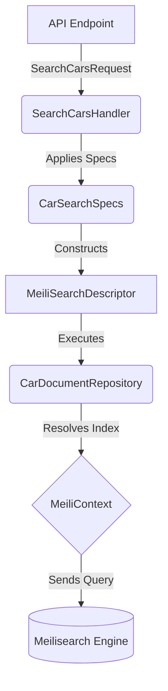

# 🏛️ Playbook.Persistence.Meilisearch

    
    
    

---

## 📖 1. Executive Summary
> [!NOTE]  
> **The Problem:** Integrating search engines directly into application logic often leads to stringly-typed, error-prone query building. Furthermore, high memory allocation during JSON serialization and disjointed schema synchronization between application models and the search engine settings can severely degrade performance and maintainability.
> 
> **The Solution:** This implementation provides a high-performance, strongly-typed Meilisearch integration in .NET 10. It utilizes Native AOT-ready Source-Generated JSON contexts for zero-allocation serialization, a custom Fluent Builder (`MeiliSearchDescriptor`) for type-safe queries, and an attribute-driven reflection system (`[MeiliFilterable]`, `[MeiliSortable]`) to automatically synchronize index settings without manual intervention.

---
    
## 🏗️ 2. Design & Strategy

### 📊 System Visualization

### 🛠️ Technical Decisions   

| Choice | Technology | Rationale  |
|------------|------------|---------|
| Language | .NET 10 | Chosen for advanced Native AOT capabilities, primary constructors, and high-performance collection expressions. |
| Search Engine | Meilisearch | Provides an ultra-fast, typo-tolerant search experience out of the box with minimal infrastructure overhead compared to Elasticsearch. |
| Serialization | System.Text.Json (Source Gen) | Eliminates runtime reflection for JSON serialization, significantly reducing GC pressure and execution time. |
| Pattern | Fluent Builder | Encapsulates the complex Meilisearch SDK parameters into a discoverable, type-safe DSL for developers. |
| Logging | Source-Generated Logger | Utilizes `[LoggerMessage]` to perform structured logging without string formatting allocations or object boxing. |

## 💻 3. Implementation Blueprint

### 📂 Key Artifacts
* `MeiliSearchDescriptor<T>.cs` & `MeiliFilterBuilder<T>.cs`: The core DSL. These files translate C# expressions (e.g., `x => x.PriceUsd`) into Meilisearch's required string formats while caching property names to avoid reflection overhead during query execution.
* `MeiliIndexConfiguration<T>.cs`: The automated index synchronization engine. It scans models for custom metadata and pushes settings to Meilisearch.
* `CarDocument.cs`: The domain model. It uses `[MeiliFilterable]` and `[MeiliSortable]` attributes to declaratively define its search behavior directly alongside the data structure.
* `SearchLogger.cs`: The observability layer, strictly optimized to bypass logging execution entirely if the specific log level is disabled.

> [!TIP]
> **Architect's Insight:** A common "Gotcha" with Meilisearch is that it will outright reject filtering or sorting queries if the target fields are not explicitly configured in the engine beforehand. By using the `[MeiliFilterable]` attributes and the `/setup` initialization endpoint, we bridge this gap automatically, ensuring the engine schema always matches the code.

## 🚦 4. Verification Guide

### 🧪 Execution Steps

1. **Initialize:** `dotnet build`
2. **Execute:** `dotnet run --project Playbook.Persistence.Meilisearch`
3. **Synchronize Settings:** Send an empty `POST` request to `http://localhost:5000/setup` to push the `CarDocument` configuration to the engine.
4. **Observe:** Send a `POST` request to `http://localhost:5000/search` with a JSON payload matching the `SearchCarsRequest` structure. Check your console to see the source-generated `SearchLogger` outputting the execution time and hit count.

## ⚖️ 5. Trade-offs & Analysis

*Every architectural choice is a compromise.*

* ✅ **Strengths:** Exceptional runtime performance due to AOT-ready JSON and cached expression trees. High developer ergonomics with type-safe query builders. Zero manual schema drift thanks to attribute-based configuration.
* ❌ **Weaknesses:** Higher initial setup complexity and abstraction overhead compared to calling the raw Meilisearch SDK directly. The automated configuration uses reflection at startup, which adds a slight initialization delay (though it is negligible and cached).
* 🔄 **Alternatives:** If the application requires complex, heavy-duty log aggregation, vector similarity search, or deep aggregations, Elasticsearch or OpenSearch might be necessary. For highly simple scripting, using the raw `MeilisearchClient` without the Repository/Builder abstractions is perfectly acceptable.

