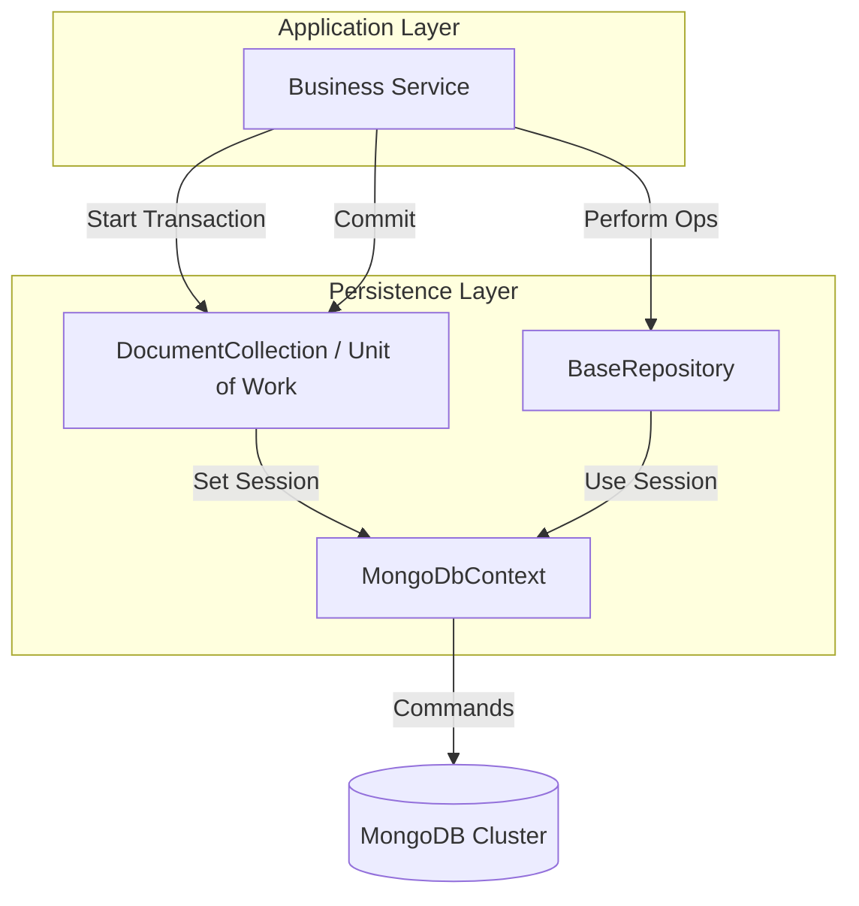

# 🏛️ [Chapter Name: e.g., Persistence with Redis]

<div align="left">
    
    
    
</div>

---

## 📖 1. Executive Summary
> [!NOTE]  
> **The Problem:** Implementing MongoDB in an enterprise .NET environment often leads to "Leaky Abstractions" where database-specific logic bleeds into the business layer. Developers frequently struggle with maintaining multi-document atomicity (transactions), handling global configuration (like Guid serialization), and managing schema indexes/seeding in a decoupled, automated way.
> 
> **The Solution:** This implementation provides a robust Persistence Layer that encapsulates the MongoDB C# Driver. It introduces a `MongoDbContext` for lifecycle management, a `DocumentCollection` acting as a Unit of Work to manage `IClientSessionHandle` for transactions, and a reflection-based `ResilientSeederService` that automatically applies indexes and seed data during startup using Polly-based retry logic.

---

## 🏗️ 2. Design & Strategy

### 📊 System Visualization


### 🛠️ Technical DecisionsChoiceTechnologyRationale

| Choice | Technology | Rationale  |
|------------|------------|---------|
| Language | .NET 8 | Leverages primary constructor syntax and improved JSON/Span support. |
| Driver | MongoDB.Driver | Official driver providing high-performance async/await support and LINQ integration. |
| Resilience | Polly | Ensures that the startup seeding process survives transient network issues during container orchestration. |
| Concurrency | Optimistic | Implemented via a `Version` property in `BaseDocument` to prevent "Lost Updates" in high-concurrency scenarios. |

## 💻 3. Implementation Blueprint

### 📂 Key Artifacts
* **MongoDbContext.cs:** The heart of the persistence layer. It manages the `IMongoClient` (connection pool) and provides the gateway for `IClientSessionHandle` to enable transactions.
* **BaseDocument.cs:** A foundational abstract class that enforces a standard schema for all documents, including `Guid` IDs, UTC timestamps, and a `Version` field for optimistic concurrency.
* **MongoDbResilientSeederService.cs:** A background worker that uses reflection to find all `IDocumentConfiguration<T>` implementations, automatically creating indexes and seeding data on startup.
* **DocumentCollection.cs:** Implements the Unit of Work pattern, coordinating transactions across multiple repositories to ensure "All or Nothing" operations.

[!TIP]
Architect's Insight: Always treat `IMongoClient` as a singleton. In this implementation, the `MongoDbContext` is registered with a scope, but it holds a reference to a `MongoClient` that should be long-lived. Re-instantiating the client on every request will exhaust your connection pool and cripple performance.

## 🚦 4. Verification Guide

### 🐳 Infrastructure (Docker)

```bash
# How to spin up the required environment
docker-compose up
```

### 🧪 Execution Steps

1. **Initialize:** `dotnet build`
2. **Execute:** `dotnet run --project Playbook.Persistence.MongoDB`
3. **Observe:** Check logs for `MongoDB Dynamic Seeding Engine started`.
    * Use a tool like **MongoDB Compass** to verify that the `ExceptionMessageDocuments` collection exists, contains seed data, and has the defined indexes applied.

## ⚖️ 5. Trade-offs & Analysis

*Every architectural choice is a compromise.*

* ✅ **Strengths:** * **Transaction Support:** Provides a clean API for multi-document atomicity via the Unit of Work.
    * **Automation:** Schema indexes and seed data are managed in code (Code-First approach), ensuring environments stay in sync.
    * **Type Safety:** The generic `BaseRepository` reduces boilerplate while maintaining strict typing.
* ❌ **Weaknesses:**
    * **Infrastructure Requirements:** Transactions in MongoDB require a **Replica Set**, increasing the complexity of local development environments.
    * **Reflection Overhead:** The seeding engine uses reflection at startup; while this adds a slight delay, it is a one-time cost.
* 🔄 **Alternatives:** If transactions aren't required, you could skip the `IClientSessionHandle` logic for simpler code.
    * For extremely high-scale write scenarios, consider moving away from a generic Repository to specialized "Command" handlers to optimize write concerns.
