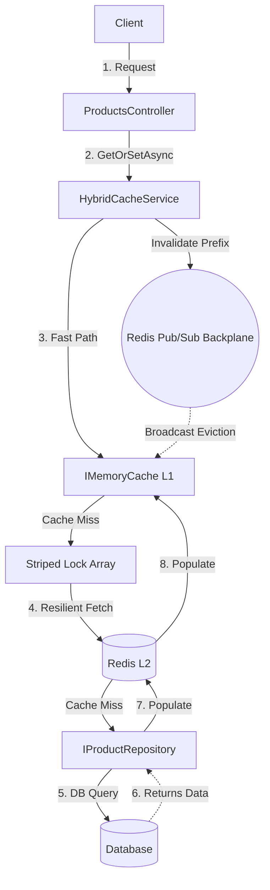

# 🏛️ Playbook.Persistence.Redis

<div align="left">
    
    
    
</div>

---

## 📖 1. Executive Summary
> [!NOTE]  
> **The Problem:** High-throughput systems facing massive read loads often overwhelm their primary databases. Introducing a distributed cache (L2, like Redis) mitigates database load but introduces network latency, serialization overhead, and the dreaded "Cache Stampede" (Thundering Herd) when a highly requested key expires. Furthermore, invalidating cache entries across multiple horizontally scaled API instances is notoriously difficult.
> 
> **The Solution:** A highly optimized **Hybrid L1/L2 Caching architecture**. This implementation combines local in-memory caching (L1) for microsecond latency with Redis (L2) for distributed state. It features **Striped Locking** to eliminate cache stampedes, a **Polly v8 Resilience Pipeline** to survive transient Redis outages, and **O(1) Versioned Prefix Invalidation** synchronized across all application nodes via **Redis Pub/Sub**.
---

## 🏗️ 2. Design & Strategy

### 📊 System Visualization



### 🛠️ Technical Decisions

| Choice | Technology | Rationale  |
|------------|------------|---------|
| Language | .NET 8 | Utilizes advanced C# features like Collection Expressions, Primary Constructors, and `readonly record struct`. |
| L2 Cache | StackExchange.Redis | The industry-standard, high-performance multiplexed client for Redis in .NET. |
| Serialization | System.Text.Json (AOT) | Uses Source-Generated `JsonSerializerContext` and `IBufferWriter<byte>` for zero-allocation, reflection-free serialization. |
| Resilience | Polly v8 | Modern, low-allocation resilience pipelines providing Circuit Breaking and Timeouts to prevent cascading failures if Redis degrades. |
| Concurrency | SemaphoreSlim (Striped) | Arrays of semaphores mapped by key hash to localize lock contention, preventing global thread blocking. |

## 💻 3. Implementation Blueprint

### 📂 Key Artifacts
* `HybridCacheService.cs`: The core orchestrator. This is the most critical file. It manages the L1/L2 fallback logic, handles the Redis Pub/Sub subscription for distributed invalidations, and implements the Striped Locking mechanism for the `GetOrSetAsync` method.
* `CompositeCacheSerializer.cs`: Demonstrates how to combine multiple Source-Generated JSON contexts (`IdentityCacheContext`, `CatalogCacheContext`) into a single high-performance serialization pipeline.
* `RedisCacheServiceCollectionExtensions.cs`: The infrastructure wire-up. Shows how to properly configure the `IConnectionMultiplexer` as a lazy singleton, bind `RedisOptions` with Data Annotations validation, and inject the Polly `ResiliencePipeline`.
* `ProductsController.cs`: The presentation layer showing the practical application of the Cache-Aside pattern and versioned invalidation triggered by domain mutations (Create/Update/Delete).

> [!TIP]
> **Architect's Insight:** Never use `KEYS *` or naive `SCAN` loops in Redis to clear cache prefixes in a production environment—it blocks the single-threaded Redis engine. This playbook solves this by appending a "Version" integer to the cache keys. To invalidate a prefix, we simply increment the version number in Redis in O(1) time and let the old keys organically expire via TTL.

## 🚦 4. Verification Guide

### 🐳 Infrastructure (Docker)

```bash
# How to spin up the required environment
docker-compose up
```

### 🧪 Execution Steps

1. **Initialize:** `dotnet build`
2. **Execute:** `dotnet run --project Playbook.Persistence.Redis`
3. **Observe:** Send a `GET /api/products/1` request. The logs will show `Repository: GetById(1) called` (Cache Miss).
    * Send the same request again. The repository log will not appear, proving the L1/L2 cache hit.
    * Send a `PUT /api/products/1.` This will trigger the `InvalidatePrefixAsync` method.
    * Send `GET /api/products/1` again. You will see the repository log reappear as the cache was invalidated across the distributed system via Pub/Sub.

## ⚖️ 5. Trade-offs & Analysis

*Every architectural choice is a compromise.*

* ✅ **Strengths:** 
    * Extremely high throughput (mostly serves from local RAM).
    * Completely immune to Cache Stampedes (Thundering Herd) under extreme concurrent load.
    * Solves the distributed L1 staleness problem via Pub/Sub backplane.
* ❌ **Weaknesses:**
    * Memory footprint is multiplied across all horizontal application nodes (L1).
    * Invalidation via Pub/Sub is eventually consistent (typically < 5ms, but not strictly transactional).
    * Higher systemic complexity compared to a standard `IDistributedCache` implementation.
* 🔄 **Alternatives:** 
    * Standard `IDistributedCache`: If your application does not suffer from massive read scaling issues or extreme latency constraints, skip L1 and use standard Redis L2.
    * FusionCache: For teams that want this exact pattern without maintaining the code, [FusionCache](https://github.com/ZiggyCreatures/FusionCache) is a fantastic OSS library that provides similar L1/L2 + Backplane capabilities out-of-the-box.